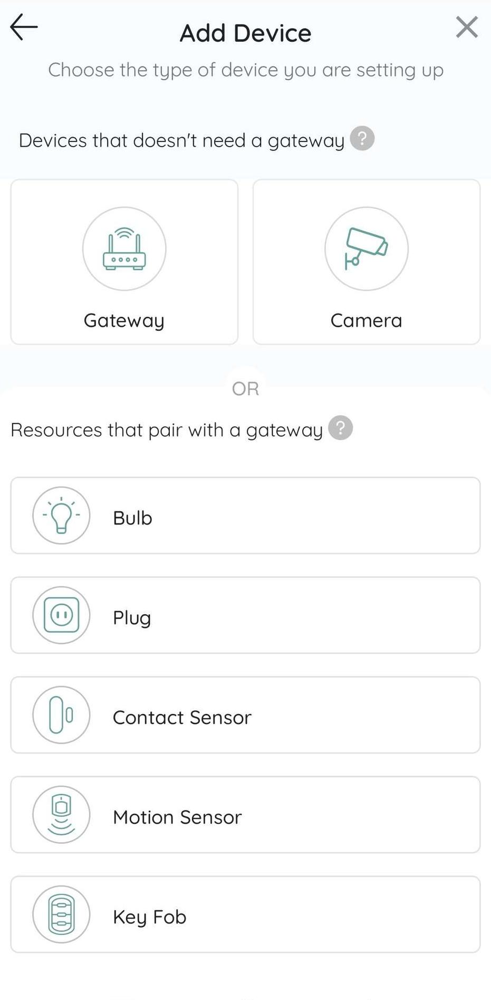

.. _quick_start_guide_linux_coco_for_devices:

Quick Start Guide
=================
Build and run your first Device App in a few short steps by following
the guide below.

1. ‘Signup’ for a new COCO account or ‘Sign In’ if you have one by following this `link <https://manage.getcoco.buzz/>`__
------------------------------------------------------------------------------------------------------------------------------

2. Create a Product for running the Sample Device App (usually will be a Product representing the SKU of the devices to be deployed).
-------------------------------------------------------------------------------------------------------------------------------------

a. Click on 'Devices’

b. Click on ‘(+) Product’

c. Fill in the details for a new Product.

3. Create a license for a device, in order to run the Sample Device App
-----------------------------------------------------------------------

a. Click on your Product to go to the Product Details page.

b. Click on ‘Device Licenses’

c. Enter the number of licenses required as 1 (usually will be entered
   as the no. of devices to be deployed for the Product).

4. Set up the Sample Device App
-------------------------------

a. Download the license file for a device, using the ‘Download’ icon.

b. Download cocodevicesdk.so

c. Download the Sample Device App source code and
   compile it by linking it to cocodevicesdk.so

d. Copy the downloaded license file to the host where you intend to run
   the Sample Device App, and rename it to **config.txt**

5. Run the Sample Device App.
-----------------------------

a. Run the Sample Device App using a command similar to:

   ::

       sudo <Sample Device App path> -d <Working Directory path> -c <config.txt path>

b. Download the ‘COCO Home’ App on your Mobile Phone (from the Apple or
   Google Store), if it’s not already downloaded.

c. Sign in using your COCO account credentials.

d. Create a new COCONet, if you don’t already have one.

e. Connect to the COCONet.

f. Click on ‘+’

g. Select ‘Devices’ in the popup menu.

h. Select ‘Gateway’

i. Select ‘Skip Internet Setup’

j. Enter the device details. The Device PSN must match the one in the
   downloaded license file.

k. Once the device is successfully added, you will see the resource
   ‘Smart Bulb’ on the home screen being refreshed continuously with
   temperature readings from our Sample Device App.

l. Click on the resource tile of ‘Smart Bulb’ to go to the Resource
   Detail page.

m. Adjust the level slider to change the Level.

n. The log messages on the console of the Sample Device App will reflect
   the new Level setting each time you change it.

