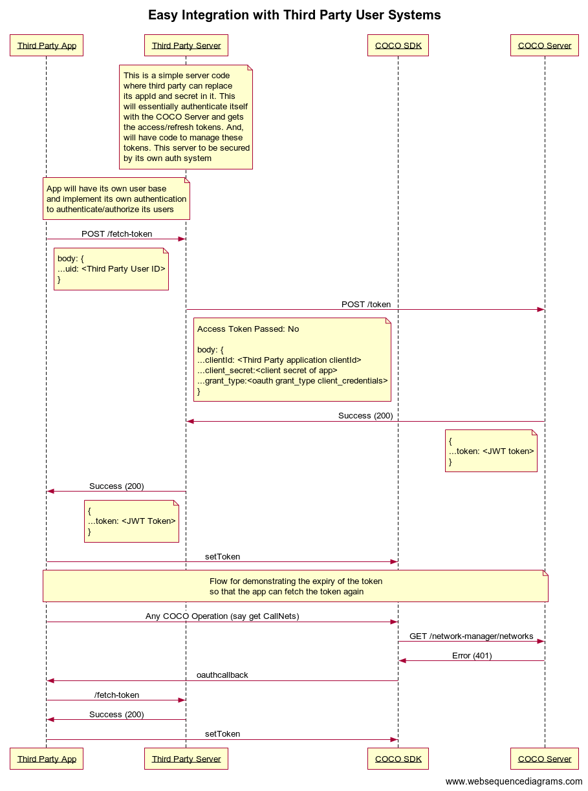

.. _introduction_to_service_apps:

Introduction to Service Apps
============================
Applications that have long-running processes or that operate without interaction with a user also need a way to access secured resources.
For this OAuth 2.0 Client Credentials grant flow is used.

They are used in the following scenarios:

1. Where you are providing your own user management system and bypass the COCO User management system
2. Where you are developing an application or integration that does not require authorization from a specific COCO user.

Flow
++++

.. sectionauthor:: Narendra
