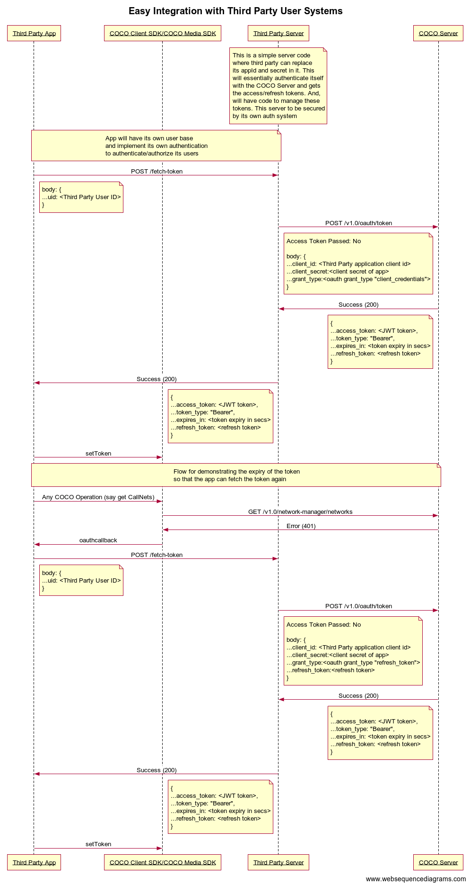

.. _introduction_to_service_apps:

Introduction to Service Apps
----------------------------
This can be primarily used by the enterprises with their own user management system,
but wanted to extend their products to integrate with the COCO Platform.
This can also be used by the Hobbyists/Developers to collate/integrate COCO
data with other systems for self use. Typically these applications
uses COCO APIs to work with their own data rather than end-user's data.

Flow
++++

