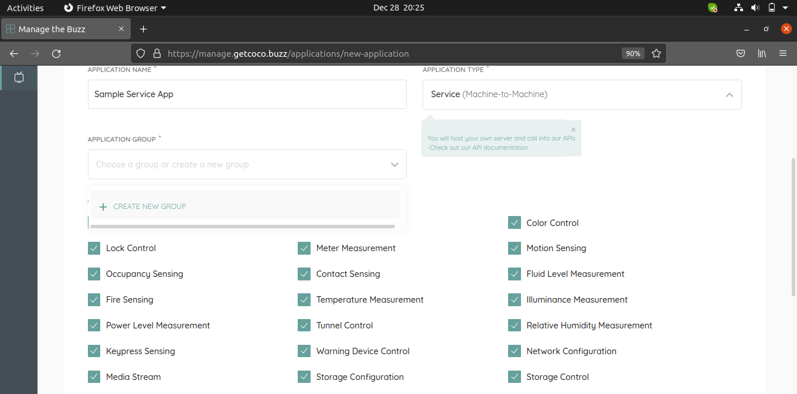

.. _quick_start_guide_service_apps:

Quick Start Guide - Service Apps
================================

Register Application
++++++++++++++++++++

1. Signup for a new COCO account or Sign In if you have one: https://manage.getcoco.buzz/
2. Click on Applications > (+) Application
3. Select application type as **Service** and fill in the details

4. For grouping of applications, select existing app group or create a new one.
5. By default all the capabilities are selected and is non editable.
6. In the app, use the above client credentials with the COCO token API to get access/refresh tokens to access COCO cloud.
   
   Token endpoint: POST https://api.getcoco.buzz/v1.0/oauth/token and takes the below params.

=============  ==================================================================================
Params         Description
=============  ==================================================================================
client_id      Client Id of your application, you can find this value in application details.
client_secret  Client secret of your application, you can find this value in application details.    
grant_type     OAuth2.0 grant type. Set it to ``client_credentials``
=============  ==================================================================================

.. note:: 
   An example service app, where third party users are managed by COCO system to keep track of respective COCONets is available at https://github.com/elear-solutions/nodesampletokenserver.git

   Service apps have access to all API's of COCO including managing COCONets.

.. sectionauthor:: Narendra
