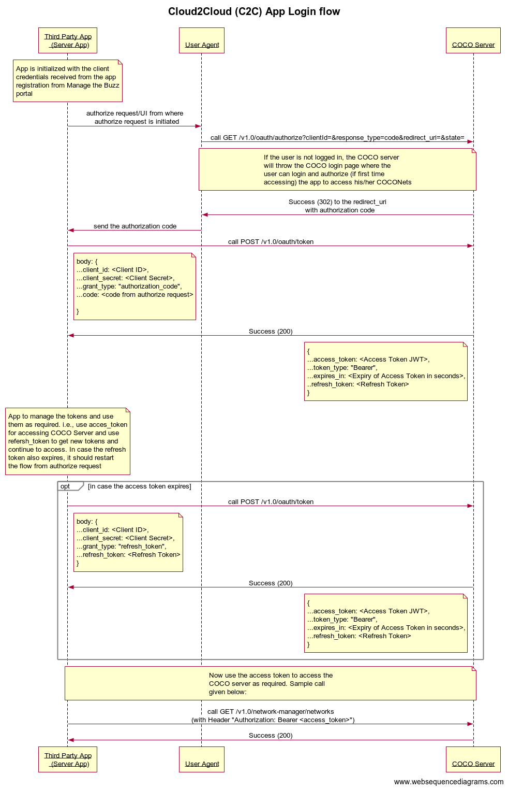

.. _introduction_to_cloud_to_cloud_apps:

Introduction
============

These are Web server based applications which can
store secrets and use the OAuth 2.0 Authorization Code grant
flow. A properly authorized web server application can access
an API while the user interacts with the application and continue
to work even after the user has left the application.
The typical usecases involve integration with other systems
where the COCO user authorizes the application to access
his/her COCONets to the Application. Example include the
Integration of COCO Home with Google/Alexa Home.

.. sectionauthor:: Narendra
