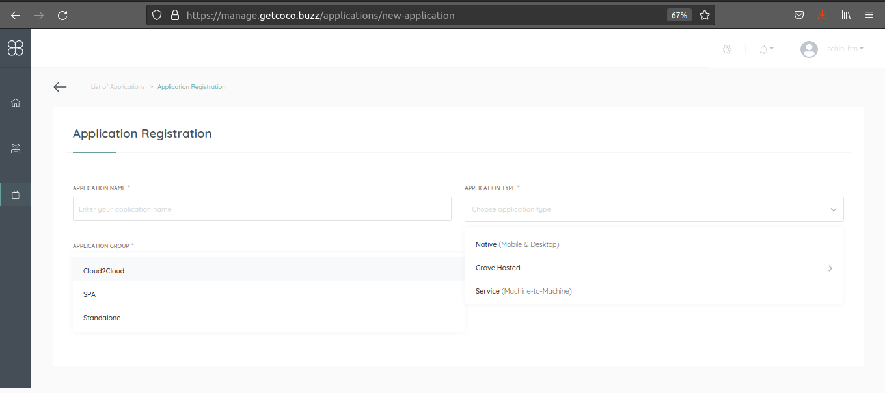

.. _quick_start_guide_cloud_to_cloud_apps:

Quick Start Guide
=================

Register Application
++++++++++++++++++++

1. Signup for a new COCO account or Sign In if you have one: https://manage.getcoco.buzz/
2. Click on Applications > (+) Application
3. Select application type as **Grove Hosted > Cloud 2 Cloud** and fill in the details
   

1. For grouping of applications, select existing app group or create a new one.
2. By default all the capabilities are selected and is non editable.
3. Redirect URI is the URL where the authorization code should be received once the user authorizes which will further be exchanged, along with client credentials, using the token API
4. Call COCO authorize API with client Id with response_type = code in the c2c app.
   
   Authorize endpoint: GET https://api.getcoco.buzz/v1.0/oauth/authorize and takes the below query params.

=============  ==================================================================================
Params         Description
=============  ==================================================================================
client_id      Client Id of your application, you can find this value in application details.
redirect_uri   Redirect URI of your application
response_type  OAuth 2.0 endpoint returns an authorization code or token. Set it to ``code``.
=============  ==================================================================================

1. Call COCO token API with client credentials and grant type as authorization_code and the code received in the authorize call to get the access/refresh tokens to access coco cloud
   
   Token endpoint: POST https://api.getcoco.buzz/v1.0/oauth/token and takes the below params.

=============  ==================================================================================
Params         Description
=============  ==================================================================================
client_id      Client Id of your application, you can find this value in application details.
grant_type     Oauth2.0 grant type ``authorization_code``   
redirect_uri   Redirect URI of your application
code           Code obtained from authorize request
=============  ==================================================================================

End User Flow
+++++++++++++

1. User logs in with COCO using his credentials
2. Authorization page is displayed with the list of app capabilities for the end user to authorize

.. image:: ../../../../_static/authorize.png

3. Once the User successfully authorizes, the application will be receiving the users access/refresh tokens to access
   the end users COCO Account and access the users COCONets and control/query the resources of the COCONets.

.. note:: 

   C2C apps can only control existing resources on COCONets.
   Example: It can only execute/read the resource information on COCONet.

.. sectionauthor:: Narendra
