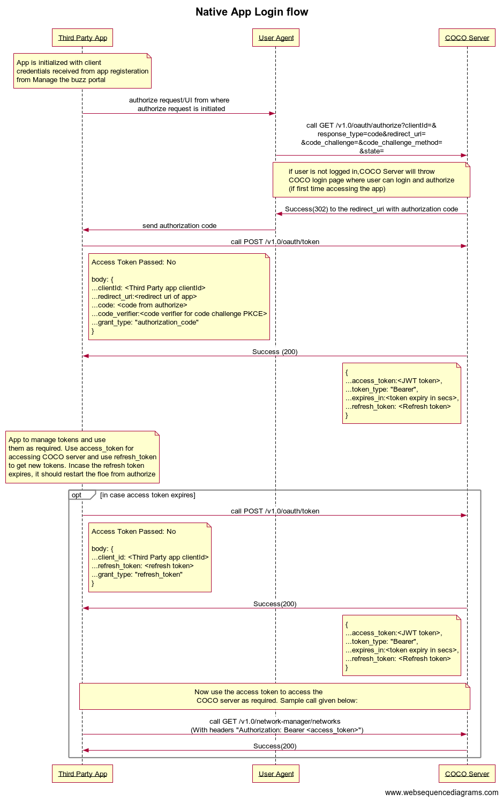

.. sectionauthor:: Narendra

.. _introduction_to_native_apps:

Introduction
============

Native Applications without your backend code,
you can use this category of applications, where you need to only write
application client code.
These are Native applications which cannot store secrets
and uses the OAuth 2.0 Authorization Code grant with PKCE flow.

.. sectionauthor:: Narendra
