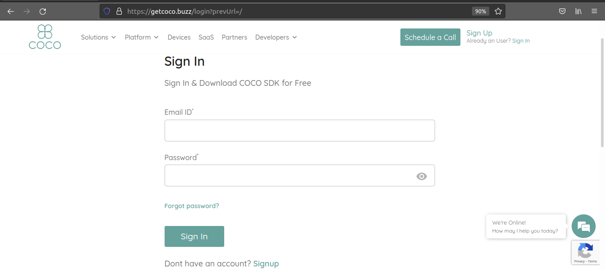

.. sectionauthor:: Narendra

.. _quick_start_guide_native_apps:

Quick Start Guide
=================

Register Application
++++++++++++++++++++

1. Signup for a new COCO account or Sign In if you have one: https://manage.getcoco.buzz/

2. Click on Applications > (+) Application

.. image:: ../../../../_static/createApplication.png

3. Select application type as **Native** and fill in the details
   For grouping of applications, select existing app group or create a new one.
   
.. image:: ../../../../_static/c2cApp.png

4. Choose capabilities required for application.
5. Redirect URI is the URL where the authorization code should be received once the user authorizes which will further be exchanged, along with client credentials, using the token API
6. We have SDKs for Android and IOS platforms. You can refer to the documentation here:
7. Call COCO authorize API with client Id with response_type = code in the Native app.
   
   Authorize endpoint: GET https://api.getcoco.buzz/v1.0/oauth/authorize and takes the below query params.

=====================  ======================================================================================
Params                 Description
=====================  ======================================================================================
client_id              Client Id of your application, you can find this value in application details.
redirect_uri           Redirect URI of your application
response_type          OAuth 2.0 endpoint returns an authorization code or token. Set it to ``code``.
code_challenge         It is a Base64-URL-encoded string of the SHA256 hash of the code verifier.
code_challenge_method  Either plain or S256 based on whether challenge is plain verifier string/SHA256 hash
state                  Random string generated by yor application to verify later
=====================  ======================================================================================

8. Call COCO token API with client credentials and grant type as authorization_code and the code received in the authorize call to get the access/refresh tokens to access coco cloud
   
   Token endpoint: POST https://api.getcoco.buzz/v1.0/oauth/token and takes the below params.

=============  ==================================================================================
Params         Description
=============  ==================================================================================
client_id      Client Id of your application, you can find this value in application details.
redirect_uri   Redirect URI of your application
grant_type     OAuth2.0 grant type ``authorization_code``
code           Code obtained from authorize request
code_verifier  Code verifier for code challenge PKCE
=============  ==================================================================================

   To get new token when current token expires, send the below params to token endpoint.

=============  ==================================================================================
Params         Description
=============  ==================================================================================
client_id      Client Id of your application, you can find this value in application details.
refresh_token  Refresh token
grant_type     OAuth2.0 grant type ``refresh_token``
=============  ==================================================================================

.. sectionauthor:: Narendra
