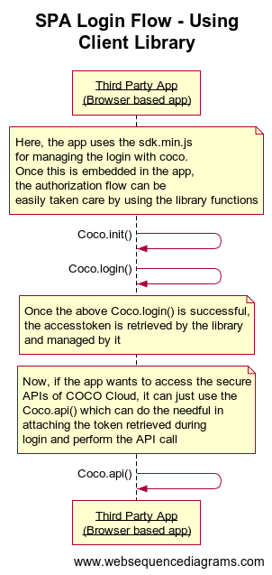
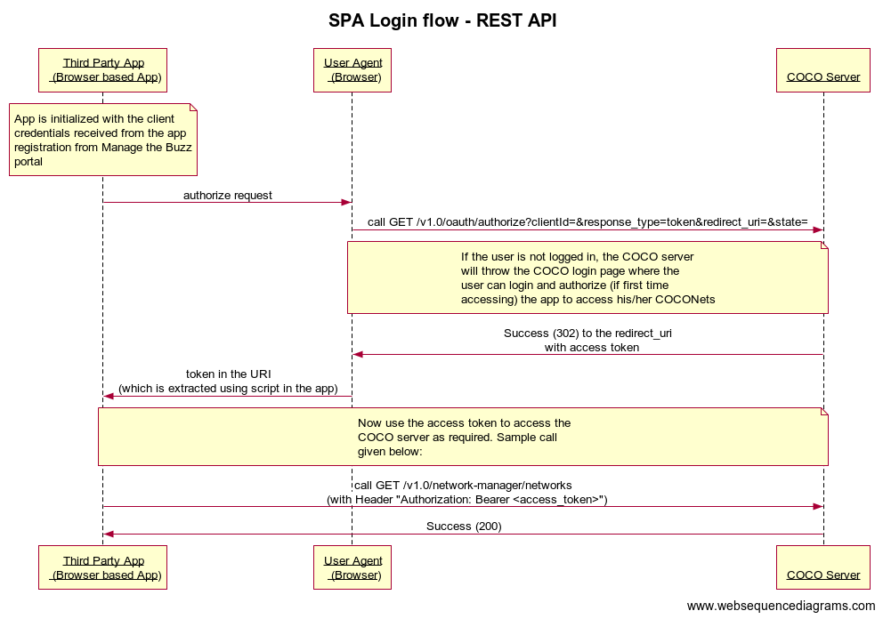

.. _introduction_to_single_page_apps:

Introduction
============

If your intent is to utilise coco data without writing backend code,
you can use this category of applications, where you need to only write
front-end browser client code. These Browser based applications cannot
store secrets and uses the OAuth 2.0 Implicit grant flow. Here,
COCO APIs are allowed access only while the user is present at the application.

**Using Client Library**

**Using Rest API**

.. sectionauthor:: Narendra
