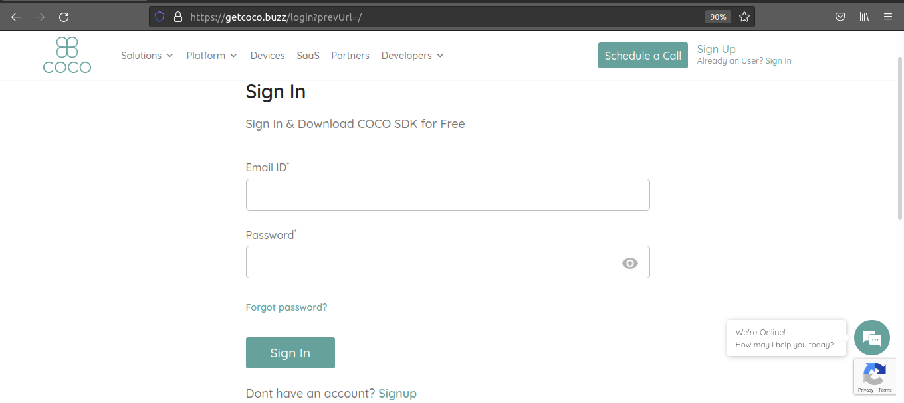
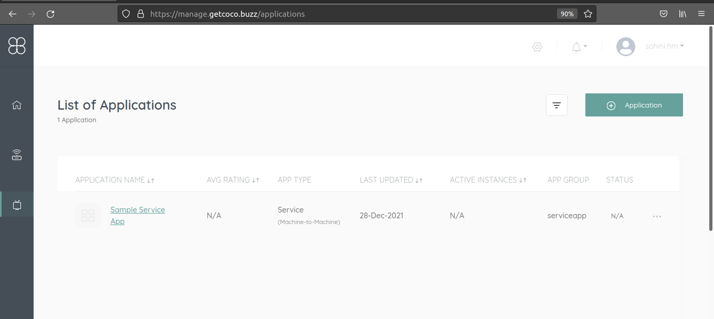
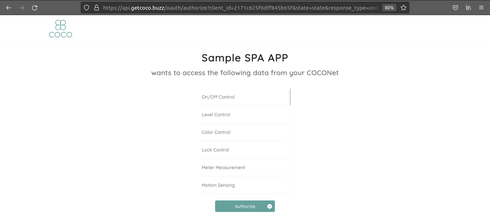

.. sectionauthor:: Narendra

.. _quick_start_guide_single_page_apps:

Quick Start Guide
=================
Register Application
++++++++++++++++++++

1. Signup for a new COCO account or Sign In if you have one: https://manage.getcoco.buzz/

2. Click on Applications > (+) Application

3. Select application type as **Grove Hosted > SPA** and fill in all the details
   For grouping of applications, select existing app group or create a new one.
   
.. image:: ../../../../_static/spaApp.png

4. Use the clientId of application and get the access token in two ways

   **Using REST APIs**

   Call COCO authorize API with client Id with response_type = token in the spa app.
   
   Authorize endpoint: GET https://api.getcoco.buzz/v1.0/oauth/authorize and takes the below query params.

=============  ==================================================================================
Params         Description
=============  ==================================================================================
client_id      Client Id of your application, you can find this value in application details.
redirect_uri   Redirect URI of your application
response_type  OAuth 2.0 endpoint returns an authorization code or token. Set it to ``token``.
=============  ==================================================================================

   **Using Client Library**
   
   We have created a client library for simplifying developers work.
   Include https://static-assets.getcoco.buzz/scripts/sdk.min.js in your application.

1. Use Coco.init() to initialize application.
2. Use Coco.login() to initiate login with COCO
3. Use Coco.api() to access COCO APIs as the management of the access tokens are taken care by the above library
4. Use Coco.logout() to clear the tokens managed by the library, when the user logs out of the application

.. code:: JavaScript

    // include sdk in Application
    

    // init application
    Coco.init({
        client_id: CLIENT_ID,
        redirect_uri: "http://localhost8000", // optional
        accessTokenExpiringNotificationTime: 300, // optional
      }).then(() => { 
        // Other initializations
      }).catch((err) => {
        // Error handling
      });

    // login
    Coco.login() // returns promise

    // access COCO APIs
    Coco.api({
      "url": url,
      "method": "GET",
      "headers": {
        'Content-Type': 'application/json; charset=utf-8'
      },
      "responseType": "json",
    }).then(
      data => {
        // handle data
      },
      error => {
        // error handling
    });

    // logout
    Coco.logout() // returns promise

.. tip::
 
   For more information refer to https://docs.getcoco.buzz/Coco.html

End User Flow
+++++++++++++

1. User logs in with COCO using his credentials
2. Authorization page is displayed with the list of app capabilities for the end user to authorize

3. Once the User successfully authorizes, the application will be receiving the users access tokens to access
   the end users COCO Account and access the users COCONets and control/query the resources of the COCONets.

.. note:: 

   SPA apps can only control existing resources on COCONets.It can only execute/read the resource information on COCONet.

.. sectionauthor:: Narendra
